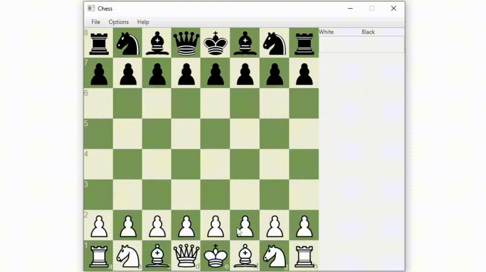

# Chess

A simple chess engine made with Java and JavaFX. Made for a casual, fan game of chess between friends. The game currently plays on one machine and besides the chess logic and the UI there is also a history log of the moves (not in chess notation - might change).

## Key Features implemented
### Necessary chess concepts:
<ul>
    <li>Basic pawn movement (for all the pieces)</li>
    <li>Illegal moves prevention</li>
    <li>Check, Checkmate and Stalemate</li>
</ul>

### Other rules:
<ul>
    <li>En passant</li>
    <li>Castling</li>
</ul>

## Features to implement
<ul>
    <li>File saving and loading</li>
    <li>Choosing side</li>
    <li>AI with MiniMax</li>
    <li>LAN game (with sockets)</li>
</ul>
